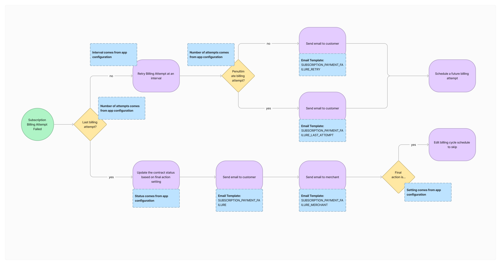

# Shopify Subscriptions

The Shopify subscriptions application provides a functioning app to create your own subscriptions application off of.
The application uses the [Shopify Remix framework](https://shopify.dev/docs/api/shopify-app-remix). In this guide, you will learn how to setup and run the subscriptions app on your local machine.

## Setup

### Requirements

- You've created a Partner account and a development store.
- You're using the latest version of [Shopify CLI](https://shopify.dev/docs/api/shopify-cli).
- You're using [node.js](https://nodejs.org/en) v20.17.0. You can use [nvm](https://github.com/nvm-sh/nvm/) to switch between versions.
- You're using [pnpm](https://pnpm.io/) as package manager.
- You're using a version of Ruby higher than 2.7.5. [Ruby is required](https://shopify.dev/docs/api/shopify-cli#requirements-themes) to run the theme extension. You may remove the theme extensions if you don't need it.

### Application setup

> [!NOTE]
> If you do not have an existing app, create one inside your partner dashboard. You will need to request specific scopes to make the application work.

#### Scopes request

- In your [partner's dashboard](https://partners.shopify.com/), under your app's API access request the following scopes:
  - Read all orders scope, which gives access to `read_all_orders`
  - Access subscriptions APIs, which gives you access to `write_own_subscription_contracts`
  - Protected customer data access, select and save `App functionality` for all `Protected customer data` and `Protected customer fields (optional)` sections, see the [following documentation](https://shopify.dev/docs/apps/launch/protected-customer-data#request-access-to-protected-customer-data) for instructions on how to proceed.

> [!NOTE]
> For the scopes `read_all_orders` and `write_own_subscription_contracts` you will require approval fropm Shopify. You can click "Request access" in the "Access subscriptions APIs" on the "API accesss" page to request the scope. Please reach out to your Shopify contact to have the team approve these scopes quicker.

#### Install dependencies

From your app directory, run the following:

```bash
pnpm install
```

#### Init and migrate the database

The subscriptions application uses [Prisma](https://www.prisma.io/) to handle communications and queries between the application and your database. The application stores information like Billing Schedule and Dunning Tracker. To work with the Subscriptions application, you will need to migrate the database to create all the tables.

From your app directory, run the following:

```bash
pnpm prisma migrate dev --name init-database
```

To confirm that your migration worked, open [Prisma Studio](https://www.prisma.io/docs/orm/tools/prisma-studio):

```bash
pnpm prisma studio
```

In Prisma Studio, click the `BillingSchedule` or `DunningTracker` tab to view the table. You should see a table with the columns that you created, and no data.

> [!TIP]
> To make setup easy, Prisma is configured with `sqlite` as the database. You can use [any other database supported by Prisma](https://www.prisma.io/docs/orm/overview/databases).

#### Add App ID environment variable

Some background jobs (ie. `CreateSellingPlanTranslationsJob`) use your app ID to filter out all events that are not from your app.
It's important to update the `APP_GID` environment variable to your app's ID to ensure proper functionality.

- Locate your app GID by opening the [partners dashboard](https://partners.shopify.com/), apps, selecting your app in the list and then
  look for the number in the URL after `/apps/` to build the app GID in the following format: `gid://shopify/App/<NUMBER>`
- Alternatively you can also get this number with an [authenticated client query on the admin api](https://shopify.dev/docs/api/admin-graphql/2024-10/queries/app)
  after the app is installed to a test shop. This number is unique across all Shops.
- Set `APP_GID=<YOUR_COMPLETE_GID>` in a `.env` file or similar.

### Start the application

```bash
pnpm shopify app dev
```

> [!NOTE]
> The first time you will run the application, the CLI will ask you questions:
>
> - Which organization is this work for?
>   - Select the organization you want to use
> - Create this project as a new app on Shopify?
>   - Select: `No, connect it to an existing app and select the app you created earlier`
> - Which store would you like to use to view your project?
>   - Select the store you want to use your app on
> - Have Shopify automatically update your app's URL in order to create a preview experience?
>   - Select `(y) Yes, automatically update`

There should be an option to press 'p' to open the app in the browser.

Congratulations 🚀, the app should run on your dev store now.

> [!Warning]
> You may encounter the following error: `Couldn't find the app with Client ID`. Run the application with the following command: `pnpm shopify app dev --reset`, this will reset your configuration.

### Deploy your app configuration to Shopify

Once your application is running, run `pnpm shopify app deploy` to deploy the [app configuration](https://shopify.dev/docs/apps/build/cli-for-apps/app-configuration) to one of your development stores. You will need to re-run this command if any scopes are added to your application after deploying for the new scopes to sync with Shopify partners.

### GraphQL codegen

This app uses GraphQL Codegen to create TypeScript types from the Shopify GraphQL schema, ensuring data returned from Shopify is automatically typed. To generate Shopify GraphQL types, configure GraphQL Codegen to output the types into a types folder using the `.graphqlrc.ts` file. Ensure your environment variables include `SHOPIFY_API_KEY`, which is your App Client ID (which can be found by clicking on your app in Shopify Partners), so that codegen creates types from your app's queries and mutations.
You will find more information on [Typing GraphQL Operations documentation page](https://shopify.dev/docs/api/shopify-app-remix/v2/guide-graphql-types).

```.env
SHOPIFY_API_KEY={Client_ID}
```

## Data storage

This application uses two types of storage for data persistence:

### Metaobjects

For data that we only need to access when we have a [session](https://shopify.dev/docs/apps/build/authentication-authorization/session-tokens) (eg: a request coming from the admin interface), this application stores data in [Metaobjects](https://help.shopify.com/en/manual/custom-data/metaobjects). Settings is currently the only table stored in metaobjects.

See the settings page route for an example of using metaobjects.

### Sqlite database with Prisma

For data that we need access to across shops (without a session, eg: background jobs), this application uses [Prisma](https://www.prisma.io/) and [SQLite](https://sqlite.org/). For ease of setup, Prisma is configured with SQLite, but you can use easily switch to any of the databases [supported by Prisma](https://www.prisma.io/docs/orm/reference/supported-databases).

## Dunning flow

The dunning flow handles failed billing attempts by listening to the `SUBSCRIPTION_BILLING_ATTEMPT_FAILURE` webhook, and enqueuing a new [DunningStartJob](./app/jobs/dunning/DunningStartJob.ts) background job. This job determines how to respond to the failed billing attempt.

The dunning flow can be configured in the app's settings page under "Payment failure settings"



## Webhooks

The app responds to several webhooks from Shopify. See the [webhookSubscriptionTopics](./app/utils/webhookSubscriptionTopics.ts) for the full list.

The [/webhooks](./app/routes/webhooks.tsx) handles webhook requests and enqueues the corresponding jobs.

## Background jobs

This app includes a custom Job Runner to schedule and run background jobs. See the [Job Runner readme](./app/lib/jobs/README.md) for more info. In production, this app uses Google Cloud Tasks, but the Job Runner could be configured to work with another job running service.

## Emails

This application is not configured to send customer or merchant emails, but the logic for when to send the emails is in place. You can plug in your own email service to [CustomerSendEmailService](app/services/CustomerSendEmailService.ts) and [MerchantSendEmailService](app/services/MerchantSendEmailService.ts).

## Related Documentation

### Shopify subscriptions

- [About Shopify subscriptions](https://shopify.dev/docs/apps/build/purchase-options/subscriptions)
- [Selling plans API reference](https://shopify.dev/docs/api/admin-graphql/2024-04/queries/sellingPlanGroups)
- [Subscription contracts API reference](https://shopify.dev/docs/api/admin-graphql/2024-04/queries/subscriptionContracts)

### Remix

- [Remix docs](https://remix.run/docs/en/main)
- [Remix for Shopify apps](https://github.com/Shopify/shopify-app-js/blob/release-candidate/packages/shopify-app-remix/README.md)

### Shopify app development

- [Getting started with Shopify apps](https://shopify.dev/docs/apps/getting-started)
- [Shopify app extensions](https://shopify.dev/docs/apps/app-extensions/list)
- [Shopify app authentication](https://shopify.dev/docs/apps/auth)
